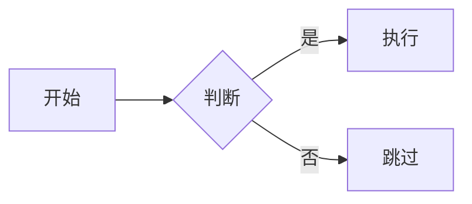

# MarkIt

实时 Markdown 预览 + 一键导出 PDF。编辑 `.md` 文件，浏览器自动刷新，所见即所得。

## 安装

```bash
pip install -r requirements.txt
playwright install chromium
```

## 启动

```bash
python3 preview.py [file.md]
```

不指定文件时默认读取 `main.md`。浏览器自动打开预览页面。

---

## 界面功能

### 顶栏按钮

| 按钮 | 功能 |
|------|------|
| 🌙 / ☀️ | 切换暗色 / 亮色模式 |
| 🎨 | 切换主题（下拉选择，↑↓ 导航，Enter 确认） |
| ⌨ | 查看快捷键说明 |
| ☰ | 显示 / 隐藏目录（固定在页面左侧，毛玻璃效果） |
| Auto Refresh | 开启 / 暂停自动刷新（1.5s 轮询） |
| Export PDF | 导出 PDF 到 `.md` 同目录 |

### 快捷键（默认）

| 键 | 功能 |
|----|------|
| `t` | 显示 / 隐藏目录 |
| `p` | 导出 PDF |
| `d` | 切换暗色模式 |
| `c` | 打开主题选择 |
| `b` | 显示 / 隐藏顶栏 |
| `a` | 切换自动刷新 |
| `k` | 显示 / 隐藏快捷键说明 |
| `l` | 切换中 / 英文界面 |
| Ctrl + 滚轮 | 缩放预览 |
| Ctrl + `+` / `-` / `0` | 放大 / 缩小 / 重置缩放 |

所有快捷键可在 `config/config.yaml` 的 `hotkeys` 节中覆盖，设为 `""` 可禁用。

---

## 配置

### `config/config.yaml`

```yaml
theme: default        # 当前主题（对应 config/themes/<name>.yaml）

font_sizes:           # 字体大小（px），所有主题共用
  title: 28
  heading: 18
  subheading: 14
  normal: 11
  code: 9
  table_header: 12

spacing:              # 间距（rem），所有主题共用
  title_after: 0.5
  heading_before: 0.4
  heading_after: 0.3

hotkeys:
  toggle_toc: t
  export_pdf: p
  toggle_dark: d
  toggle_theme: c
  toggle_topbar: b
  toggle_auto_refresh: a
  keybindings: k
  toggle_lang: l

preview:
  topbar_height: 40
  topbar_visible: true
  lang: en            # zh | en
  theme: light        # light | dark
  zoom: 1.25

buttons:
  left:  [dark, theme_switcher, keybindings, toc]
  right: [auto_refresh, export_pdf]
  # 可用 ID: dark, lang, theme_switcher, keybindings, toc, auto_refresh, export_pdf
```

### 主题文件 `config/themes/{name}.yaml`

内置主题：`default`、`github`、`solarized`、`nord`

每个主题包含亮色和暗色两套独立配色：

```yaml
name: "My Theme"

colors:          # 亮色
  title: "#1a365d"
  heading: "#2c5282"
  subheading: "#2f855a"
  text: "#1a202c"
  code_bg: "#f7fafc"
  table_header: "#2c5282"
  table_header_text: "#ffffff"
  table_row: "#ebf8ff"
  table_border: "#a0aec0"
  topbar_bg: "linear-gradient(135deg, #1a365d 0%, #2c5282 100%)"
  topbar_text: "#ffffff"

dark_colors:     # 暗色（每个主题独立配置）
  title: "#90cdf4"
  heading: "#63b3ed"
  subheading: "#68d391"
  text: "#e2e8f0"
  code_bg: "#2d3748"
  code_text: "#e2e8f0"
  table_header: "#2c5282"
  table_row: "#1e3a5f"
  table_border: "#4a5568"
  bg: "#1a1a2e"
  surface: "#1e2433"
  topbar_bg: "linear-gradient(135deg, #1a365d 0%, #2c5282 100%)"
  topbar_text: "#ffffff"
```

新增主题：在 `config/themes/` 下新建 `.yaml` 文件，重启服务器后即可在 🎨 下拉中选择。

---

## Markdown 支持

### 标题

```markdown
# 一级标题
## 二级标题
### 三级标题
#### 四级标题
```

渲染效果：四个层级字号依次递减，颜色分别对应主题的 `title` / `heading` / `subheading`，四级标题与三级同色但字号更小。

---

### 内联格式

```markdown
**加粗**、*斜体*、***加粗斜体***、~~删除线~~、`行内代码`
```

渲染效果：**加粗**、*斜体*、***加粗斜体***、~~删除线~~、`行内代码`

---

### 列表

```markdown
- 无序项 A
- 无序项 B

1. 有序项 1
2. 有序项 2
```

渲染效果：

- 无序项 A
- 无序项 B

1. 有序项 1
2. 有序项 2

---

### 代码块

```python
def greet(name: str) -> str:
    return f"Hello, {name}!"

```

渲染效果：语法高亮（highlight.js）+ 左上角语言图标（devicon）+ 右上角一键复制按钮（hover 显示）。

---

### 表格

```markdown
| 语言 | 类型 | 用途 |
|------|------|------|
| Python | 动态 | 脚本 / 数据 |
| Go | 静态 | 后端服务 |
| TypeScript | 静态 | 前端开发 |
```

渲染效果：

| 语言 | 类型 | 用途 |
|------|------|------|
| Python | 动态 | 脚本 / 数据 |
| Go | 静态 | 后端服务 |
| TypeScript | 静态 | 前端开发 |

表头使用主题 `table_header` 色，行使用 `table_row` 色，分隔行（`|---|`）自动过滤不渲染。

---

### 链接

```markdown
[MarpIt](https://github.com) 支持内联链接。
```

渲染效果：[MarpIt](https://github.com) 支持内联链接。（颜色跟随主题 `link` 色）

---

### 引用块

```markdown
> 这是一段引用内容，支持 **内联格式**。
```

渲染效果：

> 这是一段引用内容，支持 **内联格式**。

---

### 数学公式（KaTeX）

- 行内：$E = mc^2$

- 块级：
$$
\int_0^\infty e^{-x^2} dx = \frac{\sqrt{\pi}}{2}
$$

---

### Mermaid 图表



---

## 技术栈

- Python `http.server` + `watchdog` — 预览服务器与文件监听
- `playwright` (Chromium) — PDF 导出
- `PyYAML` — 配置解析
- highlight.js — 代码高亮
- KaTeX — 数学公式
- Mermaid — 图表
